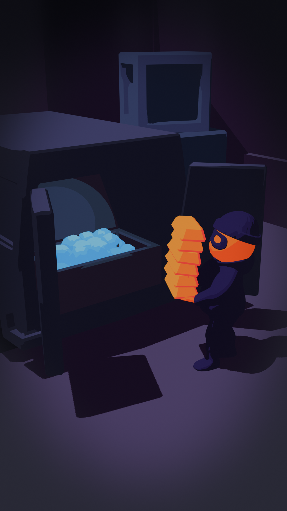

<p align="center">
  
</p>

<h1 align="center">Thief Simulator — Stealth Wars</h1>

<p align="center">
  A 3D stealth/theft mobile game built in Unity 6 (URP).<br>
  Sneak into guarded locations, steal the loot, sell it, and gear up for the next heist.
</p>

<p align="center">
  
  
  
</p>

<p align="center">
  
</p>

## About

**Thief Simulator** drops players into guarded locations where the goal is simple: grab everything that isn't nailed down without getting caught. Loot is carried to a getaway van to be sold, and the proceeds fund upgrades that make the next job easier — from lighter footsteps to faster lockpicking.

The game ships on **Android**, **iOS**, and as a **WebGL Telegram Mini App**, sharing a single codebase across all three.

## Gameplay Loop

1. **Loading → Menu** — pick a level, browse the shop.
2. **Cutscene → Playing** — infiltrate the location, avoid line-of-sight detection from guards.
3. **Steal & Carry** — pick up and stack loot (weight slows you down).
4. **Sell** — return loot to the van to progress toward 100% sold.
5. **Escape** — once everything is sold, get back to the van to win the level.
6. **Win / Fail** — spend earned currency on thief upgrades and try the next job.

## Core Systems

| System | Description |
|---|---|
| **DI / Services** (`Larje.Core`) | Services are `MonoBehaviour`s tagged `[BindService]`, wired together with `[InjectService]` field injection. |
| **Game Loop** (`ThiefGameService`) | Orchestrates state transitions (`Loading → Menu → Cutscene → Playing → Win/Fail`), level loading, UI, and ads. |
| **Level System** (`ThiefLevel`) | Builds the NavMesh at runtime, tracks loot sold vs. total, and fires completion events. |
| **Character & Abilities** (`Larje.Character`) | Composable ability system — carrying, field-of-view detection, health/damage — attached per character. |
| **Enemy AI** | Guards move through `Idle → Suspicious → Aggressive` states, each backed by a dedicated `AIBrain` with patrol/seek actions and decisions. |
| **Items & Upgrades** | Data-driven `ThiefItem`s and `UpgradeProcessor`s applied to the player at runtime. |
| **UI** (`UIService`) | Single-screen navigation plus a stacked popup system. |

### Upgrade Types
`MoreWeigth` · `LessSound` · `FasterAttack` · `Invisibility` · `FasterMovement` · `MoreMoney` · `LockPicking`

### UI Screens & Popups
- **Screens:** Loading, Menu, Play, Win, Fail, Shop
- **Popups:** Revive, Pause, Settings, Item, Upgrades, Mini-game variants

## Tech Stack

| Package | Purpose |
|---|---|
| [DOTween](http://dotween.demigiant.com/) | Tweening — animations and timed sequences |
| [Dreamteck Splines](https://dreamteck.io/splines/) | Spline-based movement (van trajectory, patrol paths) |
| Firebase | Analytics + backend |
| Google Mobile Ads | AdMob interstitials/rewarded ads |
| Unity Addressables | Asset loading |
| Cinemachine | Camera rigs |
| Unity AI Navigation | Runtime NavMesh baking |

## Getting Started

This project builds through the **Unity Editor** only — there are no CLI build scripts.

1. Install **Unity 6000.3.11f1** via Unity Hub.
2. Clone the repo, then pull submodules:
   ```bash
   git submodule update --init --recursive
   ```
3. Open the project in Unity Hub.
4. Open one of the two main scenes:
   - `Assets/Scenes/Game.unity` — mobile build (Android / iOS)
   - `Assets/Scenes/Game Web.unity` — WebGL / Telegram build

## Project Structure

```
Assets/
├─ Scenes/              Game.unity, Game Web.unity
├─ Scripts/
│  └─ Character/AI/     Enemy AI actions & decisions
├─ Plugins/
│  └─ ProjectConstants/ Auto-generated shared enums (do not hand-edit)
└─ Imported/             Submodules: core framework, character, ads, analytics, map editor
```

Shared framework code (`Larje.Core`, `Larje.Character`, ads, analytics, map editor) lives in separate git submodules under `Assets/Imported/`.

## Telegram Mini App

`TelegramBridge` wraps the Telegram WebApp JS SDK (alerts, invoice payments, user ID, bot data) via `[DllImport("__Internal")]`. All calls safely no-op in the Editor and in non-WebGL builds.
